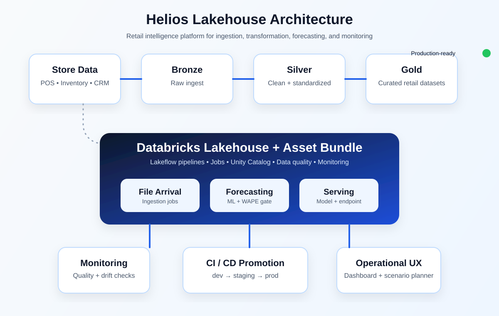

# Helios Lakehouse

Helios Lakehouse is the Databricks Asset Bundle for Helios Retail Group. It brings together ingestion, transformation, forecasting, quality monitoring, and model serving in a single infrastructure-as-code workflow.

This project is the operational implementation behind the retail intelligence platform and supports the full delivery path from raw data to production serving.

## What this bundle includes

| Area | What it does |
| --- | --- |
| Bronze / Silver / Gold | Spark declarative pipelines for raw, standardized, and curated retail data |
| Ingestion | file-arrival and scheduled ingest jobs |
| Forecasting | feature engineering, training, evaluation, and batch inference |
| Model serving | Unity Catalog registration and production serving endpoint |
| Quality | Lakeflow expectations, drift checks, and monitoring |
| Delivery | GitHub and Azure DevOps promotion workflows |

## Architecture at a glance



### Promotion flow

```text
feature/*  →  develop  →  staging  →  main
                  (dev deploy)   (challenger)   (prod)
```

## Repository layout

```text
databricks.yml          # bundle configuration and environment targets
resources/              # jobs, pipelines, UC objects, monitors, and ML resources
src/helios_lakehouse/   # Python code executed by jobs and pipelines
tests/unit/             # unit tests without Spark dependency
.github/workflows/      # CI and deployment automation
azure-pipelines.yml     # Azure DevOps promotion pipeline
```

## Prerequisites

Before the first deployment, make sure you have:

- Databricks CLI `>= 0.250.0`
- Python 3.11
- a Databricks workspace with Unity Catalog enabled
- a service principal for staging and production
- GitHub OIDC federation or Azure DevOps federated credentials

Update every `REPLACE_ME_*` host, warehouse ID, and principal UUID in `databricks.yml` before deploying.

## Local validation loop

```bash
python -m venv .venv && source .venv/bin/activate
pip install -e ".[dev]"
make test
make validate          # databricks bundle validate -t dev
make deploy-dev        # personal-prefixed copies, schedules paused
databricks bundle run bronze_ingest -t dev
```

Development mode prefixes resource names with `[dev <you>]` and pauses schedules, which helps keep laptop-based work safe and isolated.

## CI/CD workflow

| Workflow | Trigger | Target | Purpose |
| --- | --- | --- | --- |
| `ci-validate.yml` | pull request | `dev` | lint, test, and bundle validation |
| `deploy-dev.yml` | push to `develop` | `dev` | deploy development bundle |
| `deploy-staging.yml` | push to `staging` | `staging` | integration and challenger validation |
| `deploy-prod.yml` | push to `main` | `prod` | approved production rollout |

Authentication uses **OIDC**. Required repository variables include:

- `DATABRICKS_HOST_DEV` / `_STAGING` / `_PROD`
- `DATABRICKS_CLIENT_ID` for the relevant environment

Avoid storing `DATABRICKS_TOKEN` in GitHub secrets.

## Promotion rules

1. Gold pipelines do not run a `full_refresh` in production from CI.
2. Training registers a new model version only when holdout WAPE is within the approved threshold.
3. Staging writes the `Challenger` alias while production serving pins the `Champion` alias.
4. Monitor jobs can trigger retraining, but they do not deploy serving changes directly.

## Identity and permissions

- **dev** uses the deploying user as `run_as` for personal copies
- **staging / prod** use the shared service principal
- bundle permissions are separated by role: platform admins, engineers, and scientists

## Typical usage

- ingest raw store and ecommerce data
- standardize it into Silver tables
- publish Gold datasets for analytics and decision support
- train and validate demand forecasting models
- promote approved versions across the deployment lifecycle
- monitor quality and retraining signals in production

## License

Internal Helios Retail Group example. Adapt freely for your own lakehouse implementation.
